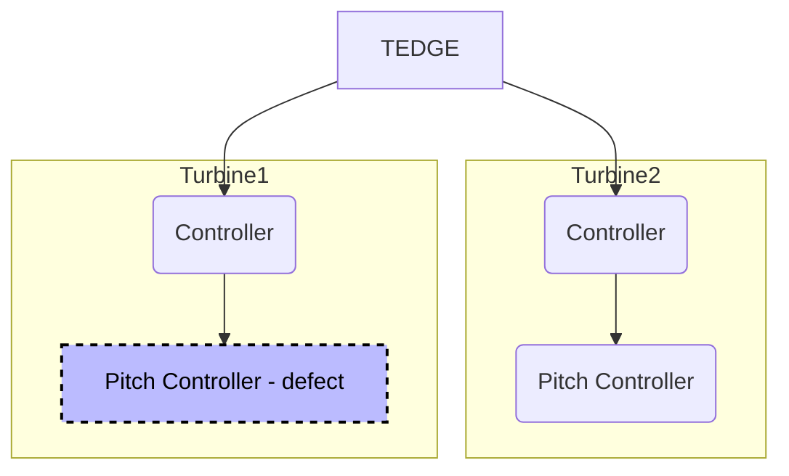
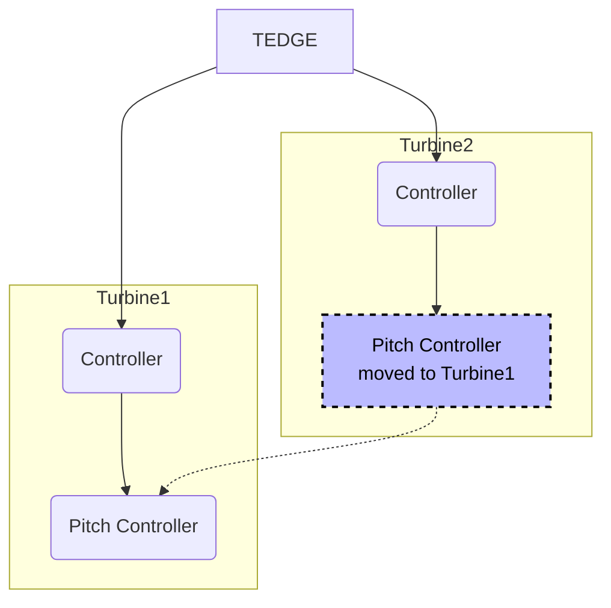
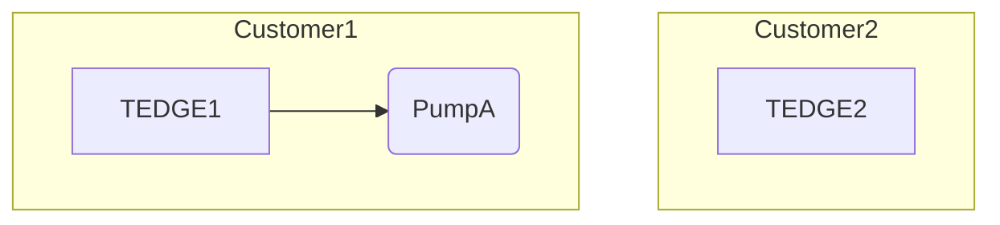
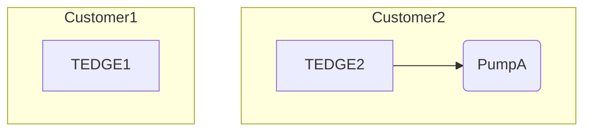

# Proposal amendments

## Flexible target hierarchy

The main difference between Proposal 1 and this extension is the separation of the topic target, and the semantic meaning related to the topic target.

The following shows topic structure broken down into the different segments.

```sh
[Root]/[Family]/[Device ID]/[Application]/[Instance ID]/[Channel]
```

Where `[Channel]` is the target's data, e.g. measurements, commands etc.

:::tip
Below shows an example of the proposal 1 topic structure broken into the topic segments.

```sh
te/device/main/service/tedge-agent/[Channel]

# root = te
# family = device
# device-id = main (which is an alias for the device-id)
# application = service
# instance id = tedge-agent
```
:::


### Family

```sh
te/[Family]
```

The Family topic field shall be unique for the given device or application. The topic field shall be the family identifier from the part number or parent part number for derived non-standards. For unique non-standard equipment that are not derived from an existing product this should be the first characters from the non-standard part number that identify it as the family.

### Device ID

```
te/[Family]/[DeviceID]
```

The Device ID topic field shall be used to transmit information about the particular device such as additional identity information.

This shall only be transmitted on initial connection to the broker or after any change to the payload contents.

This topic shall be present in all message transmissions to uniquely identify the transmitting device to the consumers.

#### Payload

```jsonc
{
    "@id": "",  // Use [Family]/[DeviceID] if the id is empty
    "@type": "Service",
    "displayName": "Home",
    "id": [
        "custom_identifier"
    ]
}
```

Inspiration could be taken from the [Azure DTDL approach](https://learn.microsoft.com/en-us/azure/digital-twins/concepts-models), for example:

```json
{
  "@id": "dtmi:com:adt:dtsample:home;1",
  "@type": "Interface",
  "@context": "dtmi:dtdl:context;2",
  "displayName": "Home",
  "contents": [
    {
      "@type": "Property",
      "name": "id",
      "schema": "string"     
    },    
    {
      "@type": "Relationship",
      "@id": "dtmi:com:adt:dtsample:home:rel_has_floors;1",
      "name": "rel_has_floors",
      "displayName": "Home has floors",
      "target": "dtmi:com:adt:dtsample:floor;1"
    }
  ]
}
```

**Other references**

* [DTDL.v2 Specification](https://github.com/Azure/opendigitaltwins-dtdl/blob/master/DTDL/v2/DTDL.v2.md#internationalized-resource-identifier)
* [JSON-LD: JSON for Linking Data](https://json-ld.org/)


### Application

```sh
te/[Family]/[Device ID]/[Application]
```

The Application topic field shall be present in all message transmissions to uniquely identify the transmitting application to the consumers. This field may be empty on single application devices where the application can be inferred from the device family.

This topic does not have a payload specified and has no meaning without further topic levels appended.

This topic level (even if empty) shall be present in all message transmissions.

### Instance ID

```
te/[Family]/[DeviceID]/[Application]/[InstanceID]
```

The Instance ID topic field shall be used to transmit information about the particular instance of the application where more than 1 can be executing on the device such as additional identity information and manifest of this software package.

This shall only be transmitted on initial connection of the application to the broker or after any change to the payload contents.

This field may be empty on single application devices where the application instance can be inferred from the device family.

This topic level (even if empty) shall be present in all message transmissions.


|Segment|Description|Example|
|-------|-----------|-------|
|`Family`|Device/component family type|`flowserve`, `tedge`, `mycompany`|
|`DeviceID`|Typically the device's serial number, however it can also be another unique identifying name. It only needs to be unique under the same `Family`|`A12BAC0001`|
|`Application`|Application responsible for the data. The user is free to configure an appropriate name, or to leave it blank|`main`|
|`InstanceID`||

```sh
te/device/main/service/tedge-agent/[Channel]

# family = tedge
# device-id = main (which is an alias for the device-id)
# application = service
# instance id = tedge-agent
```

Proposal 1 was already following this pattern, but it just called the different topic segments by different names.

```sh
te/device/main/service/tedge-agent/[Channel]

# family = tedge
# device-id = main (which is an alias for the device-id)
# application = service
# instance id = tedge-agent
```

**Example topic with custom applications**

```sh
te/flowserve/1234/eventp/standby1/o/<id>
te/flowserve/1234/monitoring/standby2/m/FLOW_INLET
```

ExternalID = `flowserve`

```
te/docker/tedge-agent///

{
    "@id": "flowserve/1234",
    "@type": "service"
}
```

```
te/+/+/monitoring/+/
te/+/+/+/+/
```

```
te/docker/service/tedge-agent//measurements/memory
```

## Registration

### Manual Registration

:::info Discussion points
* How to normalize the registration of devices and services. Does a device need to be registered via `te/[Family]/[DeviceID]` first, then the application can be registered via `te/[Family]/[DeviceID]/[Application]/[InstanceID]`?
    * Or should the device also be registered using empty application/instance values: e.g. `te/[Family]/[DeviceID]//`
    * Does publishing to `[Application]/[InstanceID]` really need to be limited to publishing to a service only? Or can the topic also be allowed to publish to the main device directly (by just setting the `@type` property in the payload to `MainDevice`)?

        Multiple applications could publish data to the same main device representation in the cloud

        ```sh
        mosquitto_pub -r -t te/device/pump01/custom/app1 -m '{"@type":"MainDevice"}'
        mosquitto_pub -r -t te/device/pump01/custom/app2 -m '{"@type":"MainDevice"}'
        ```
:::

**Device**

A device (main or child) can be registered via the following topic:

```
te/[Family]/[DeviceID]
```

For example a tedge service could register itself by publishing to the following topic:

```shell
mosquitto_pub -r -t te/device/pump01 -m '{"@type":"ChildDevice"}'
```

Or if you want to register a nested child (child of a child), then you can specify a `contents` property to describe the relationship.

```shell
mosquitto_pub -r -t te/tedge/pump02 -m '
{
    "@type":"ChildDevice"
    "contents": [
        {
            "@type":"Relationship",
            "target":"pump01"
        }
    ]
}'
```

This device topic could also be used to communicate the status of the entity, for example if the entity is functioning correctly, or also include additional meta information to better describe the entity (e.g. hardware manufactured date etc.)

```shell
mosquitto_pub -r -t te/flowserve/A12BCD -m '
{
    "@type":"ChildDevice",
    "contents":[
        {
            "name":"manufacturedAt",
            "value":"2020-01-01"
        }
    ]
}
'
```

**Application**

An application can be registered via the following topic:

```
te/[Family]/[DeviceID]/[Application]/[InstanceID]
```

For example a tedge service could register itself by publishing to the following topic:

```sh
mosquitto_pub -r -t te/device/main/service/tedge-agent -m '{"@type":"MainService"}'
```

This entity topic could also be used to communicate the status of the entity, for example if the entity is functioning correctly, or also include additional meta information to better describe the entity (e.g. hardware manufactured date etc.)

```sh
mosquitto_pub -r -t te/flowserve/A12BCD -m '{"@type":"ChildService", "contents":[{"name":"manufacturedAt","value":"2020-01-01"}]}'
```

Other components can subscribe to all devices using the following MQTT subscription:

```sh
mosquitto_sub -t te/+/+ -F '%t\t%p'
```

```shell title="Output"
te/device/main/service/tedge-agent       {"t":"service"}
```


### Automatic (inferred) registration (WIP)

On an MQTT level, the topics structure does not need to represent the device hierarchy as different clouds support different mechanisms to represent the digital twins and related components.

However for some devices having an initial registration process may not be feasible due to technically limitations.

Instead the entity type (e.g. device, service, child device, service of child device) could be inferred by matching portions of the topic.


```toml
# WIP: example configuration is not done
[registration.topic.family]
service = "service"
```

Or alternatively, the four-part segments could be used to unique name of the child device or service:

|Topic|ExternalID|Notes|
|----|-----|---|
|`te/device/main//`|`tedge:gateway_0001`|
|`te/device/main/service/tedge-agent`|`tedge:gateway_0001:service:tedge-agent`|
|`te/device/child01//`|`tedge:gateway_0001:child01`|The main device is inferred for child devices|
|`te/device/child01/service/tedge-agent`|`tedge:gateway_0001:child01:service:tedge-agent`|The main device is inferred for child devices|
|`te/device/subchild01/?`|`tedge:gateway_0001:subchild01`|The main device is inferred for child devices|
|`te/device/subchild01/service/tedge-agent`|`tedge:gateway_0001:subchild01:service:tedge-agent`|The main device is inferred for nested child devices|
|`te/customnamespace/subchild01/?`|`customnamespace:gateway_0001:subchild01`|Use custom `[Family]` to allow users users to add a namespace if the subchild01 conflicts with other child devices or nested child devices|

* Users are free to use custom `[Family]` values to enable their own namespacing requirements


Where `main` is a reserved word which is always replaced with the `device-id` of the main device, e.g. `gateway_0001` (or it could be made configurable in the `tedge.toml`).

:::info Discussion points
* If an external id is added to the meta information, who is responsible for adding it, and how does that work if multiple clouds need different external identities?
:::


## Meta information

### Channel meta information

Meta information such as an alarm message and description, can be published to the MQTT topic to all

```sh
mosquitto_pub -r -t te/device/main/service/tedge-agent/m/myalarm/meta -m '{"msg":"Inlet flow rate is low","desc":"The flow rate on the inlet is too low and could indicate a blockage. Check the intact filter for any blockages"}'
```

Any interested components can subscribe to the meta information by doing the following wildcard subscription:

```sh
mosquitto_sub -t te/device/main/service/tedge-agent/m/+/meta
```

Or if you want to subscribe to all of the meta information for all possible telemetry data, then you can 

```sh
mosquitto_sub -t te/+/+/+/+/+/+/m -F '%t\t%p'
```

```shell title="Output"
te/device/main/service/tedge-agent/m/myalarm/meta   {"msg":"Inlet flow rate is low","desc":"The flow rate on the inlet is too low and could indicate a blockage. Check the intact filter for any blockages"}
```

This flexibility allows components to subscribe to exactly the information that is needed.

## Use-cases

### Use-case 1: Swapping equipment due to a defect (Wind Turbines)




**Replace Pitch Controller 1 with Pitch Controller 2**



A wind park contains multiple turbines which offer. Each turbine uses the same components, and the parts can be used interchangeably in each turbine. Let's say that Turbine 2 is down for routine maintenance and will be offline for a longer period of time due to the long lead time of a critical part. In the meantime, Turbine 1 has a smaller fault which prevents it from working. The service technician decides to take a working component from Turbine 2 and put it into Turbine 1 in order to have at least 1 functioning turbine. The technician also orders a spare replacement part. Once both parts arrive for Turbine 2, the turbine is made operational again, and the original parts that were moved from Turbine 2 to Turbine 1 remain where they are.

The component which is moved from Turbine 2 to Turbine 1 is a generic component which has the same name, and it only knows where the parent is by using a fixed ip address (as each turbine has its own isolated network with fixed ip addresses).

### Use-case 2: Rentable devices

A company manufactures a water pump but instead of selling the pump to the customer, they rent out the pump for a period of time to different customers. The business model relies on the fact that the pumps are only required for a short amount of time, and are deemed to expensive to buy once and maintain.

The pump manufacturer would like to monitor the pump's usage so that the customer can be billed accordingly to how hours the pump is used. The pump needs to be serviced every 1000 operational hours, and after 50000 operational hours, the pump needs a full refurbishment (e.g. replacing some components which can't be serviced).

To ensure the quality of service, the pump manufacturer wants to monitor the operational hours of the pump as well with other telemetry data to ensure the correct functioning of the equipment.

In addition, since the pump is being rented out to different customers, the customer is in control how and where the pump is used. From a communications perspective, it can mean that the pump does not have direct internet access, and instead is only reachable via intermediatory gateways which are also available for rent from the same manufacturer providing the pump. However in such multi-hop communication path environments, the manufacturer is not interested in how the pump is connected to the internet, it just cares about viewing the information from the pump.

The pump manufacturer tracks which customer has the pump purely in the Cloud environment. There is no reason for the information about where the pump is currently deployed to be known by the pump itself.


**Current month**



**Next month**



### Use-case 3: Service responsible for the management of containers (e.g. docker, podman)

A device running docker has a single service which is responsible for monitoring other container which are also modelled as tedge service but of the type `container`.

Since the container are running on the main device where thin-edge.io is running, then the service will be added to the main device to model that the service are dependent on the resources made available by the main device.

The service responsible for monitoring of containers has the following requirements:

* Update the status of other containers by publishing their status's periodically
* Monitor itself and indicate whether the service is healthy or not (as if the service is unhealthy it is an indication that the container status's may be stale)


### Use-case 4: Streaming analytics

Let's say that you have a stream of measurements being published on a single topic, however you don't want to send the measurements directly to the cloud as this would increase the cloud storage cost, and the raw measurements are sometimes not so interesting. Instead you would like to process the measurements using streaming analytics and only send an alarm based on specific characteristics; for example only send data when there is a significant change in value (step change).

Ideally the measurements should be published to a similar MQTT topic as other measurements to avoid unnecessary configuration of the device/service sending the measurements.

#### Solution 1: Use ACL to limit read from specific topics

If there not a small set of pre-defined application topics, then it is easier to write a mosquitto ACL (Access Control List) rule to limit the visibility of messages published on specific topics. For example, the Cumulocity IoT cloud mapper, `tedge-mapper-c8y`, could be denied access to the `te/+/+/analytics/+/#` topics whilst allowing the analytics engine to react to all messages on the same topic.

Below is an example which shows that messages specific to the `analytics` application can be used by other components to publish messages to without being automatically sent to the cloud. The `analytics` application is then free to process the inputs and generate derived messages (e.g. threshold triggering, alarm generation, aggregation etc.) and publish those to the cloud instead.

Let's assume that the `anayltics` app is listening to all types of messages published to the `analytics` application:

```
te/+/+/analytics/+
```

The visibility of the analytics topics can be restricted to specific application by applying the following mosquitto ACL rules. In short the rules deny the `tedge-mapper-c8y` access  to any message published to `te/+/+/analytics/+/#` and grants the `analytics` application read/write access to the same topic.

```shell title="Mosquitto ACL file"
topic readwrite te/#

user tedge-mapper-c8y
topic readwrite te/+/+/+/+/#

user tedge-mapper-c8y
topic deny te/+/+/analytics/+/#

user analytics
topic readwrite te/+/+/analytics/+/#
```

The above mosquitto ACL file can be tested by starting two terminals where the first terminal will act as the `tedge-mapper-c8y` application, and the second as the `analytics` application.

```shell title="Client 1: tedge-mapper-c8y"
mosquitto_sub -t "te/+/+/+/+/e/+" -u tedge-mapper-c8y -P "****"
```

```shell title="Client 2: analytics"
mosquitto_sub -t "te/+/+/+/+/e/+" -u analytics -P "****"
```

In another terminal, publish an event to the `/analytics/` topic. You should see that  the`tedge-mapper-c8y` application does not receive the event, where as the `analytics` application does.

```shell title="Client 3: Event publisher"
mosquitto_pub -t "te/device/main/analytics/e/TLHI_001" -m '{"text":"Hi tank level"}'
```

**References**

* [mosquitto configuration guide](https://mosquitto.org/man/mosquitto-conf-5.html)

#### Solution 2: Mapper should only subscribe to desired applications (or telemetry types)

If there is a fixed number of applications then the the cloud mapper can be configured to only subscribe to the application which should have their messages automatically sent to the cloud (and not via the analytics application)

Using the new [Configurable topics](https://github.com/thin-edge/thin-edge.io/pull/2033) feature for the `tedge-mapper`, the following configuration can be used to control which topics the cloud mapper should subscribe to.

```shell title="/etc/tedge/tedge.toml"
[c8y]
topics = [
    "te/+/+/app1/+/#",
    "te/+/+/app2/+/#",
    "te/+/+/app3/+/#"
]
```

### Use-case 5: Easy of subscribing to telemetry data

Subscribing to all telemetry data does not usually make sense as each telemetry entity has a different payload format, so it is best practices to only subscribe to messages that the payload format is know to prevent future telemetry data types from breaking any implementation.

In the MQTT logger scenario the user will generally want to subscribe to all messages, not just the telemetry data, and this is possible using one of the following wildcard subscriptions:

```bash
# All data
mosquitto_sub -t "te/#"

# Or excluding the meta information topics
mosquitto_sub -t "te/+/+/+/+/+/+"

# Or specific telemetry data types: measurements
mosquitto_sub -t "te/+/+/+/+/m/+"

# Or events
mosquitto_sub -t "te/+/+/+/+/e/+"

# Or alarms
mosquitto_sub -t "te/+/+/+/+/a/+"
```

:::info Discussion point
Subscribing to a common topic for all telemetry data (e.g. `tedge/+/+/telemetry/#`) has the disadvantage to being fragile against future additions of telemetry data types where the payload structure is not yet known. Subscribing to known topics is safer for each component and as long as the list is finite, then it not so cumbersome for each component.
:::

## Advantages of MQTT Proposal

* Fixed sized hierarchy
* Child devices grouped by type
* Services grouped by type too
* Uniqueness of a child id for a given type
* Uniqueness of a service id for a given type for a child device.
* Empty level when it doesn't apply e.g. tedge///measurements 

And two pearls:

* publish retain messages on the base topics associated to child devices and services to store metadata e.g. to provide info about tedge/child/123.
* use a meta suffix topic with retained messages to store metadata about publish data! e.g. tedge/child/123/measurements/meta.

## Next steps

1. Specify the contain (exclude the retina points for now)
2. How can registration can be used (dual ownership of data)
3. Topic structure of the commands
4. Prepare the ramp up of transitioning from the existing topic structure to the main
    * e.g. use `tedge/` for the old and `te/` for the new specification
